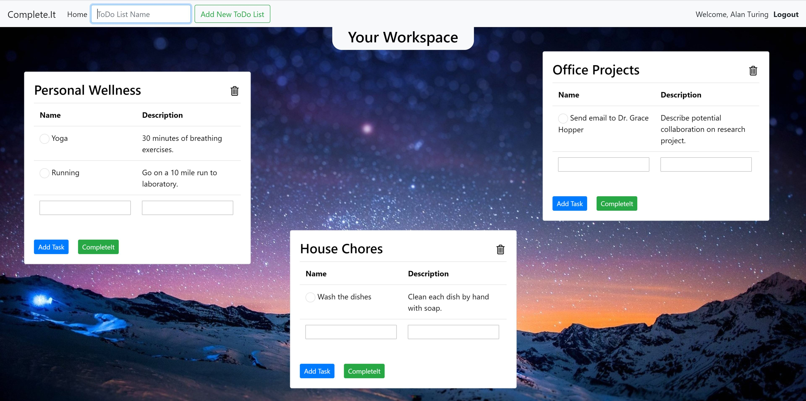
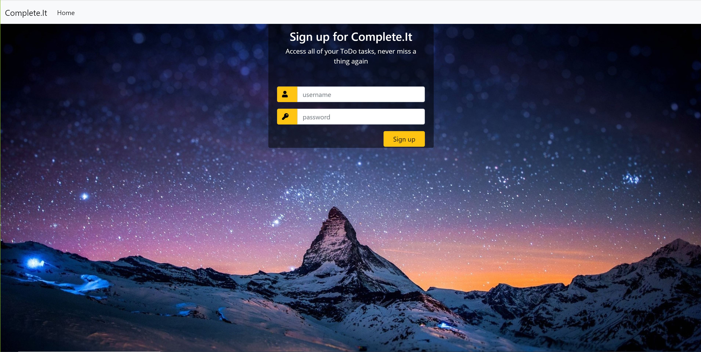
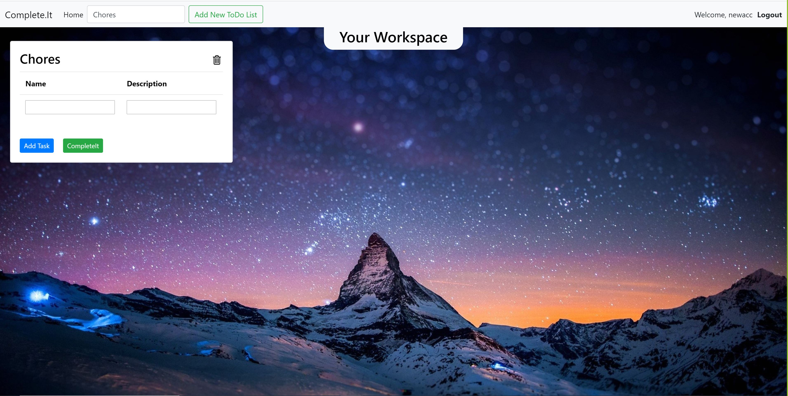

# Complete.It
An application to manage all of your daily tasks!

<strong>Project Website:</strong> http://complete-it.herokuapp.com

<!-- TABLE OF CONTENTS -->
## Table of Contents

* [About](#about)
  * [Built With](#built-with)
* [Usage](#usage)
* [Authors](#authors)
* [License](#license)

<!-- ABOUT THE PROJECT -->
## About



We built <strong>Complete.It</strong> to help you properly manage your tasks and increase productivity on a daily basis! We understand the challenges and overcomplications that can be found with many existing task managements systems, and we designed <strong>Complete.It</strong> with a minimalistic and effective interface that strategically maximizes your organizational success.

Below, we describe in detail the practices and styling that we emphasized during our design and development process. 
<strong>Complete.It</strong> was envisioned and developed with the following frameworks and technology stack:
* We prioritized incorporating the fundamental tools available in <strong>Angular</strong>, including routes, directives, services, data binding, and HTTP requests.
* With <strong>Flask</strong> and Python 3.8, we implemented REST API endpoints for user authentication and integration with MongoDB collections for performing CRUD operations.
* We established a NoSQL database model with <strong>MongoDB</strong> and managed multiple collections of information.
* We deployed our application frontend and backend to a cloud platform using <strong>Heroku</strong>, and built skills in deployment configuration and DevOps.

Through the engineering design and implementation process, we have gained an advanced knowledge of industry-leading technologies and applied them to create a minimalistic and effective utility product. We have interwoven our skillsets of front-end and back-end frameworks to produce an application that reduces the time necessary to implement and manage your personal productivity pipeline.

### Built With
* [Angular](https://angular.io)
* [Flask](https://pypi.org/project/Flask)
* [MongoDB](https://www.mongodb.com)
* [Heroku](https://www.heroku.com)
* [Bootstrap](https://getbootstrap.com)
* [HTML](https://html.com)

## Usage

1. Create an account with a distinct username and password, and log in to that account.
<p align="center">
 
 <br>
 <em>Sign Up Screen</em>
</p>

2. Make the best use of Complete.It by creating new notes by category!
<p align="center">
 
 <br>
 <em>In your workspace, you can add new lists of items and organize all of your administrative needs</em>
</p>

3. Now, you can manage all of your tasks and new ideas in one convenient place! 
**We hope you enjoy using Complete.It :) Please reach out to us if you have any new feature ideas you would like to see!**

<!-- CONTRIBUTING -->
## Authors

* **Ishaan Radia** - Rising Junior at North Carolina State University studying Statistics and Computer Science. - [LinkedIn](https://linkedin.com/in/ishaan-radia) - [GitHub](https://github.com/iiradia)

* **Michael Dacanay** - Rising Junior at North Carolina State University studying Computer Science. - [LinkedIn](https://linkedin.com/in/michael-dacanay) - [GitHub](https://github.com/MichaelDacanay)

<!-- LICENSE -->
## License

Distributed under the MIT License. See ```LICENSE.md``` for more information.
